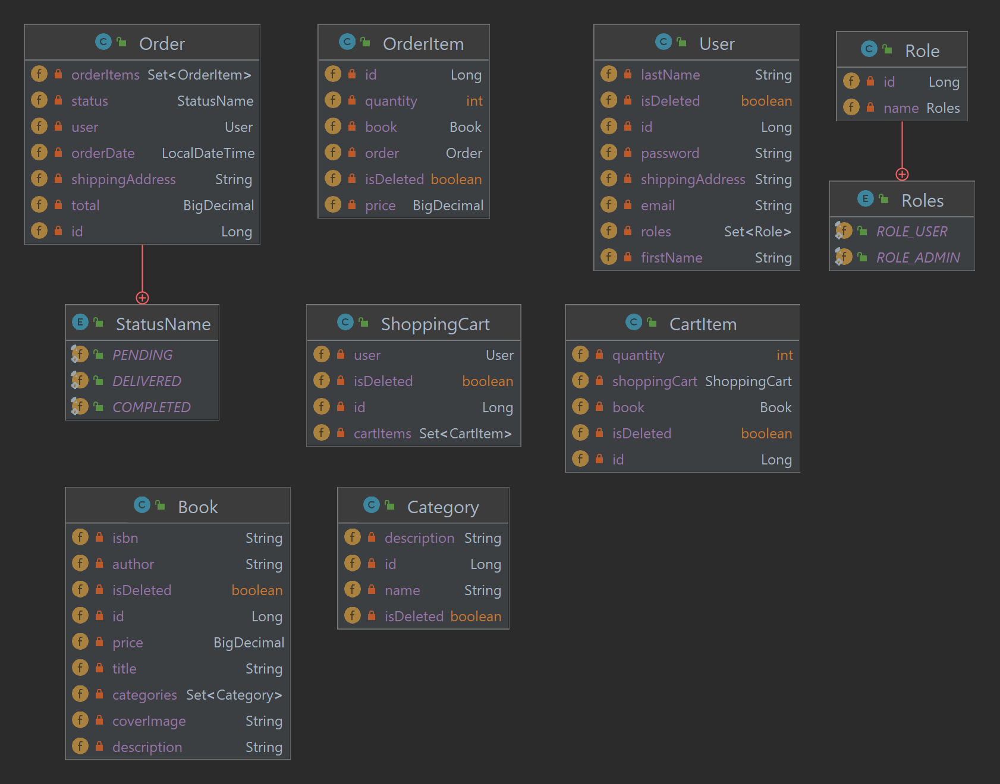

# Online Book Store 🛒📚

A Spring Boot–powered backend for an online bookstore, featuring user authentication, role-based access control, shopping cart, and order management.

---

## 🚀 Features

- **User Management**  
  Registration and login with JWT-based authentication. Passwords secured with BCrypt.

- **Role-Based Access Control**  
  `USER` and `ADMIN` roles enforced via Spring Security.

- **Book Management**  
  CRUD operations on `Book` entities (title, author, ISBN, price, description).

- **Category Management**  
  CRUD operations on `Category` entities and listing books by category.

- **Shopping Cart**  
  Add, view, update, and remove `CartItem`s in a `ShoppingCart`.

- **Order Processing**  
  Place orders from the cart, view past orders, and manage order status.

- **Search**  
  Find books by author, title, isbn via a search endpoint.

- **API Documentation**  
  Swagger/OpenAPI endpoints via Springdoc.

---

## 🛠️ Tech Stack

| Layer            | Technology                      |
|------------------|---------------------------------|
| Framework        | Spring Boot                     |
| Security         | Spring Security, JWT            |
| Persistence      | Spring Data JPA (Hibernate)     |
| Database         | MySQL / H2 (test)               |
| Validation       | Hibernate Validator             |
| Documentation    | Springdoc-OpenAPI (Swagger)     |
| Testing          | JUnit5, Mockito, Spring Test    |
| CI/CD            | Maven, GitHub Actions           |

---

## 📦 Getting Started

### Prerequisites

- Java 17+
- Maven 3.6+
- MySQL

### Clone the Repository

```bash
git clone https://github.com/<your-username>/online-book-store.git
cd online-book-store
```

Configure application properties
Copy it in yours .env file

| Key                      | Value                          |
|--------------------------|--------------------------------|
| MYSQLDB_ROOT_PASSWORD    | your_root_password_here        |
| MYSQLDB_USER             | your_user_here                 |
| MYSQLDB_PASSWORD         | your_password_here             |
| MYSQLDB_DATABASE         | your_database_name_here        |
| MYSQLDB_LOCAL_PORT       | 5434                           |
| MYSQLDB_DOCKER_PORT      | 5432                           |
| SPRING_LOCAL_PORT        | 8088                           |
| SPRING_DOCKER_PORT       | 8080                           |
| DEBUG_PORT               | 5005                           |

After Startup

Once containers are running:

API Base URL: http://localhost:8088

Swagger UI: http://localhost:8080/swagger-ui/index.html

# API Endpoints

Postman collection: [postman_collection.json](postman_collection.json)

## /auth
- `POST /auth/register` – Register a new user
- `POST /auth/login` – Authenticate and receive JWT

## /users
- `GET /users/me` – Get current user profile (USER role)
- `PUT /users/me` – Update current user profile (USER role)
- `PUT /users/{id}/role` – Update another user's role (ADMIN role)

## /books
- `GET /books` – List all books (USER role)
- `GET /books/{id}` – Get a book by ID (USER role)
- `GET /books/search?name={name}` – Search books by name (USER role)
- `POST /books` – Create a new book (ADMIN role)
- `PUT /books/{id}` – Update a book (ADMIN role)
- `DELETE /books/{id}` – Remove a book (ADMIN role)

## /categories
- `GET /categories` – List all categories (USER role)
- `GET /categories/{id}` – Get category by ID (USER role)
- `POST /categories` – Create a category (ADMIN role)
- `PUT /categories/{id}` – Update a category (ADMIN role)
- `DELETE /categories/{id}` – Remove a category (ADMIN role)

## /cart
- `GET /cart` – View current user's cart (USER role)
- `POST /cart/items` – Add item to cart (USER role)
- `PUT /cart/items/{itemId}` – Update cart item quantity (USER role)
- `DELETE /cart/items/{itemId}` – Remove item from cart (USER role)

## /orders
- `POST /orders` – Place an order (USER role)
- `GET /orders` – List current user's orders (USER role)
- `GET /orders/{orderId}` – Get order details (USER role)
- `PUT /orders/{orderId}/status` – Update order status (ADMIN role)

# Entity Diagrams
